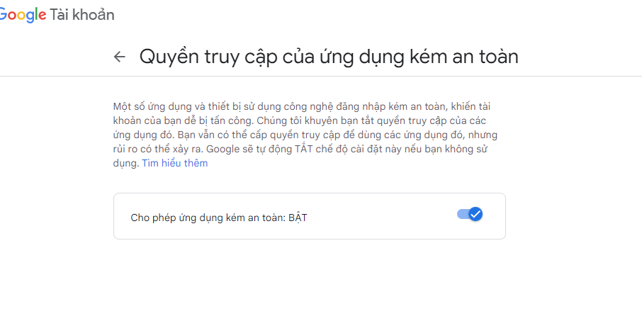

# laravel9_send_mail_using_gmail_smtp_server
## 1. Install Laravel 9
```Dockerfile
composer create-project laravel/laravel laravel9_send_mail_using_gmail_smtp_server
```
## 2. Make Configuration
- Vào .env
```Dockerfile
MAIL_MAILER=smtp
MAIL_HOST=smtp.gmail.com
MAIL_PORT=587
MAIL_USERNAME=1812767@dlu.edu.vn
MAIL_PASSWORD=nhập password của email
MAIL_ENCRYPTION=tls
MAIL_FROM_ADDRESS=1812767@dlu.edu.vn
MAIL_FROM_NAME="${APP_NAME}"
```
- Chú ýnhập password của email
- Chú ý bật tính năng sau của email





